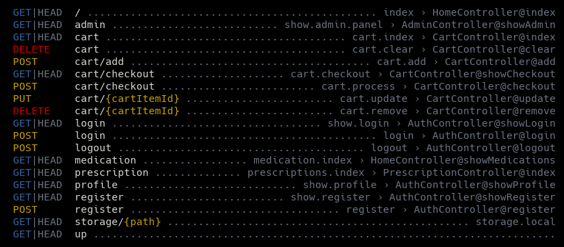
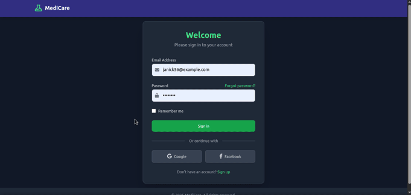
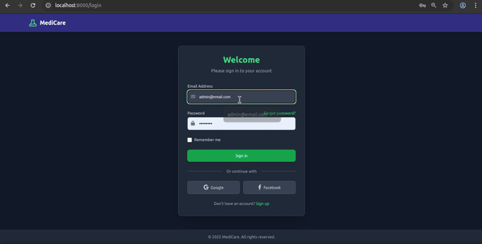

# MediCare

A web application for managing and operating a pharmacy, built with Laravel 12 and styled with Tailwind CSS.


## Features

*   **Prescription Management:**  View Prescriptons on /profile for each user or in /prescriptions.
*   **Inventory Management:** Track stock levels, both in /profile end-point or in /medications.
*   **Product Catalog:** Browse and search for medications.
*   **User Authentication:** Secure registration and login for admin and general users.
*   **Admin Dashboard:**  A central dashboard for managing all aspects of the pharmacy. (/admin end-point)

## End-Points


## Index Page


## Add to Cart and User Profile


## Admin Panel


## Getting Started
You can use docker-compose to deploy the MariaDB database. <br>check the `docker/` folder for the docker-compose.yaml
```bash
cd docker
docker-compose up
#Ctrl + C to exit

#Or
cd docker
docker-compose up -d

#To Delete
docker-compose down 
```

### Prerequisites

*   PHP >= 8.2
*   Composer
*   Laravel >= 12.0
*   Mysql/MariaDB or other compatible databases that Laravel support

### Installation

1.  Clone the repository:

    ```bash
    git clone [your-repository-url]
    cd [your-project-directory]
    ```
2.  Install Composer dependencies:

    ```bash
    composer install
    ```
3.  Copy the `.env.example` file to `.env` and configure your database settings:

    ```bash
    cp .env.example .env
    ```
4.  Generate an application key:

    ```bash
    php artisan key:generate
    ```
5.  Run database migrations and seed it with some fake data:

    ```bash
    php artisan migrate
    php artisan migrate:fresh --seed
    ```
6. Serve the application to Localhost 
    ```bash
    php artisan serve
    ```


### Database Configuration

Update the `.env` file with your database credentials:


### Usage
After running the seeder, you can log in to your application's admin panel using the following default credentials:

*   **Email :** `admin@email.com`
*   **Password :** `admin1234`
